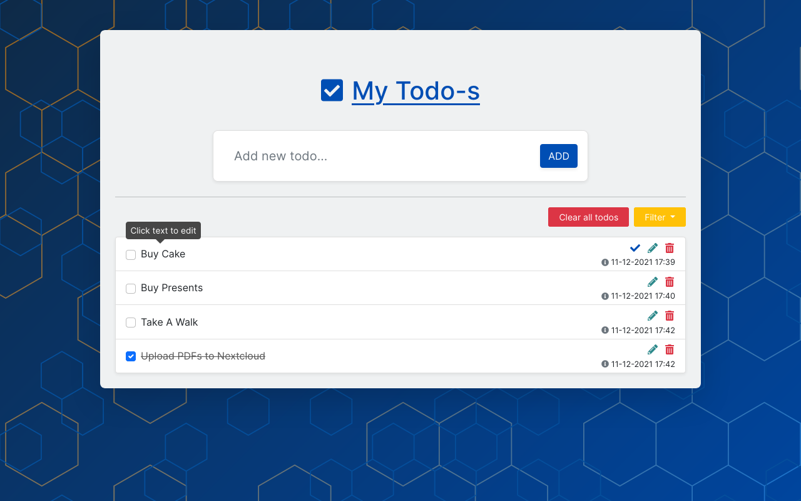
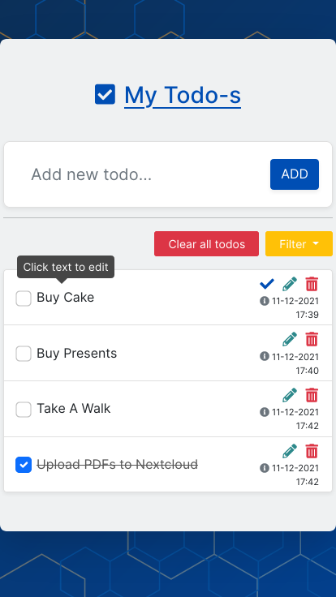

# Javascript TODO List

Fully responsive TODO list with that uses Local Storage to save tasks

## Tehnologies used:

- HTML & CSS
- Vanilla Javascript
- Bootstrap CSS Framework

### Other tools used

- [Font Awesome](https://fontawesome.com/) icons

## Features:

- Responsive layout
- Local Storage
- Filter todos option
- Edit todo
- Todo timestamp
- Clear All

## Demo

### Live preview: [link](https://davidtrikic.github.io/todo-list/)

## Screenshots

